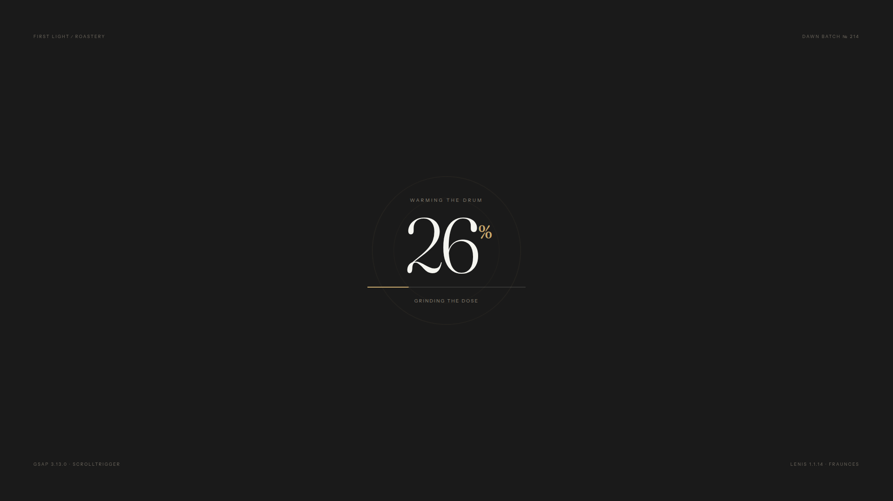
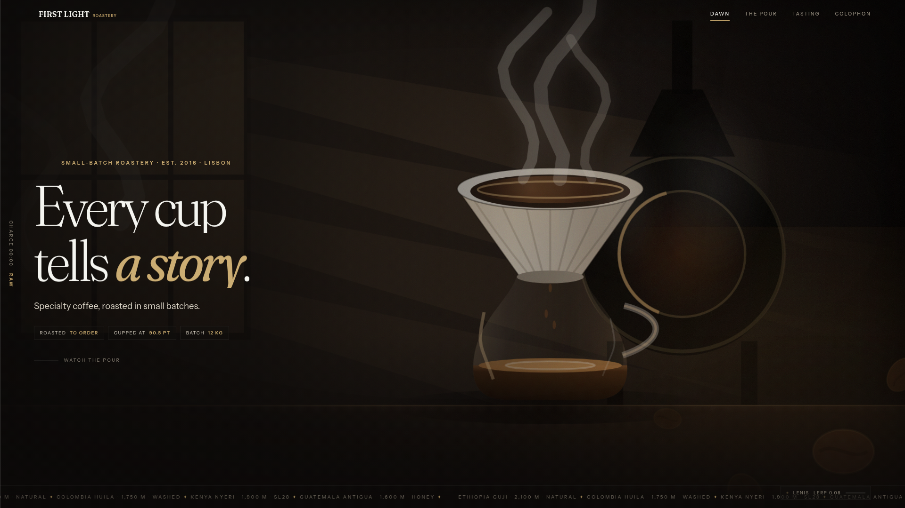
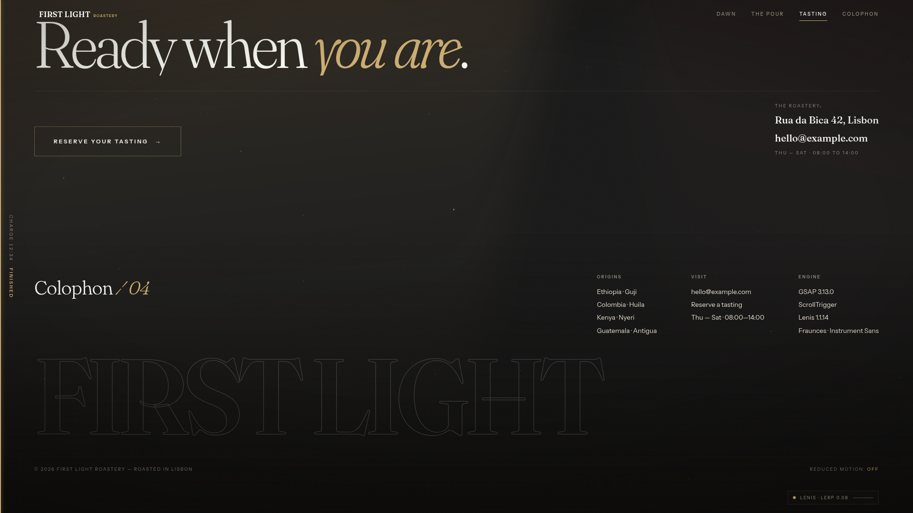

# First Light Roastery — Technical System Architecture

## Overview & System Mission

**First Light Roastery** is a zero-dependency, cinematic scroll landing page designed with pure native web standards. The architecture delivers fluid 60fps motion, bespoke procedural Canvas 2D art, responsive scroll-driven interactive state transitions, and robust performance without reliance on heavy build bundlers, CSS utility frameworks (zero Tailwind), or paid animation plugins.

### Key Architectural Pillars
- **Zero Build / Zero Framework**: Native HTML5, CSS3 with `:root` tokens, and vanilla JavaScript ES6+.
- **Pure CSS Design Tokens**: Locked design token system in CSS variables.
- **Native Typography & Line Splitting**: Bespoke `splitLines()` engine utilizing native `TreeWalker` and DOM probes, eliminating dependencies on GSAP SplitText.
- **Scroll Guard & Preloader API**: Hard input locking (`wheel`, `touchmove`, `keydown`) while loading, coupled with an extensible async promise registration system (`window.preloader.register`).
- **Procedural Canvas 2D Render Engine**: Mathematical rendering of environment, lighting, room optics, steam wisps, glass carafes, ceramic drippers, and coffee pour dynamics, acting as both live rendering engine and progressive fallback.
- **Smooth Scroll & Timeline Synchronization**: GSAP 3.13.0 + ScrollTrigger pinned scrubbing synchronized with Lenis 1.1.14 smooth scrolling ticker.

---

## Design System & Token Architecture

The design system is grounded in a dark, atmospheric palette representing a coffee roastery at dawn.

```css
:root {
  /* Brand Core Tokens */
  --color-bg: #1a1a1a;
  --color-text: #f5f5f0;
  --color-accent: #c9a96e;

  /* Atmospheric Supporting Palette */
  --color-ink: #12100e;
  --color-bean: #2c1d14;
  --color-cherry: #9c4227;
  --color-fog: #dcd5c6;
  --color-ash: #8f8779;

  /* Surface Lines & Accents */
  --line: rgba(245, 245, 240, 0.13);
  --line-soft: rgba(245, 245, 240, 0.07);
  --accent-dim: rgba(201, 169, 110, 0.42);

  /* Layout & Easing */
  --pad: clamp(1.1rem, 4.5vw, 4.5rem);
  --ease-out: cubic-bezier(0.16, 1, 0.3, 1);

  /* Variable Typography */
  --font-display: 'Fraunces', serif;
  --font-body: 'Instrument Sans', sans-serif;
}
```

---

## State Breakdown, Snapshots & Visual Architecture

Automated DOM snapshots and high-resolution 1920x1080 viewport captures document each major state sequence:

### State 1: Preloader & Input Scroll Guard



- **Screenshot**: `screenshots/01-preloader.png`
- **DOM Snapshot**: `snapshots/01-preloader.html`
- **Architectural Highlights**:
  - The root element `<html>` maintains class `.is-loading`, activating an invariant scroll guard.
  - Non-passive event listeners for `wheel`, `touchmove`, and `keydown` intercept all scroll attempts before the preloader completes.
  - Async assets (webfonts, procedural canvases, frame pre-decoding) register promises into `window.preloader.register()`.
  - Continuous percentage counter (`#pl-count`) and animated CSS progress track (`#pl-bar`) communicate load progress.

---

### State 2: Hero Section & Motion Build (FOUC Visual Fix)



- **Screenshot**: `screenshots/02-hero.png`
- **DOM Snapshot**: `snapshots/02-hero.html`
- **Architectural Highlights**:
  - Multi-layered depth parallax background (`.hero-bg`, `.hero-mid`, `.hero-fg`) with fine-pointer spotlight cursor tracking via CSS custom properties (`--sx`, `--sy`).
  - Native line-splitter `splitLines()` wraps headline typography into `.line-mask` and `.line-inner` containers without paid GSAP SplitText.
  - **Critical Visual Bug Fix**: Inside `buildMotion()`, `introTL.from(h.lines, ...)` explicitly mandates `immediateRender: true`. This prevents Flash of Unstyled Content (FOUC) where headline text momentarily renders before GSAP initializes line transform matrices.

```javascript
heroH1.forEach(function (h) {
  introTL.from(h.lines, {
    y: '100%',
    opacity: 0,
    stagger: 0.05,
    duration: 0.8,
    ease: 'power3.out',
    immediateRender: true
  }, .12);
});
```

---

### State 3: Narrative & Brand Story


- **Screenshot**: `screenshots/03-story.png`
- **DOM Snapshot**: `snapshots/03-story.html`
- **Architectural Highlights**:
  - Transition zone from Hero to pinned sequence stage.
  - Infinite hardware-accelerated marquee ticker (`#ticker`) displaying bean origins and elevation specs.
  - ScrollTrigger scroll-spy updating HUD navigation status (`.hud__nav a.is-active`).
  - Progress rail indicator on the left viewport margin tracking roast time (`Charge MM:SS`).

---

### State 4: Sequence Stage 01 — Raw Ingredients


- **Screenshot**: `screenshots/04-sequence-raw.png`
- **DOM Snapshot**: `snapshots/04-sequence-raw.html`
- **Architectural Highlights**:
  - ScrollTrigger pins `#sequence` container over `+=300%` scroll distance.
  - Canvas 2D scene (`#sequence-canvas`) renders Stage 01 (progress `0.0`): unroasted raw coffee beans resting beside an empty ceramic dripper and glass carafe.
  - Stepper indicator (`#stepper li[data-step="0"]`) lights up active step.
  - Step Card 01 ("Sourced with intention") transitions into view via `sequenceStage` event bus.

---

### State 5: Sequence Stage 02 — Mid-brew


- **Screenshot**: `screenshots/05-sequence-mid.png`
- **DOM Snapshot**: `snapshots/05-sequence-mid.html`
- **Architectural Highlights**:
  - Frame scrubbing at progress `0.5`: procedural gooseneck kettle enters, pouring 94°C water into the ceramic dripper cone.
  - Procedural bloom calculations generate dynamic coffee grounds expansion and rising steam wisps (`wisp()` algorithm).
  - Step Card 02 ("Roasted to order") smoothly replaces Card 01 with hardware-accelerated transforms.

---

### State 6: Sequence Stage 03 — Finished Pour


- **Screenshot**: `screenshots/06-sequence-finished.png`
- **DOM Snapshot**: `snapshots/06-sequence-finished.html`
- **Architectural Highlights**:
  - Frame scrubbing at progress `1.0`: glass carafe is full, steam settles, and gooseneck kettle retracts.
  - Progress bar (`#seq-fill`) reaches 100%, updating frame readout (`Stage 03 / 03`) and side rail status (`Finished`).
  - Step Card 03 ("Brewed with care") completes the pour-over trilogy narrative.

---

### State 7: Tasting Table CTA & Colophon



- **Screenshot**: `screenshots/07-colophon.png`
- **DOM Snapshot**: `snapshots/07-colophon.html`
- **Architectural Highlights**:
  - Grand typography call-to-action ("Ready when you are.") with magnetic pointer interaction (`data-magnetic`).
  - Interactive Colophon displaying roastery location, operating hours, tech stack specifications, and giant outlined branding text (`.colophon__word`).
  - Motion preference detector (`#motion-state`) displaying live `prefers-reduced-motion` detection status.

---

## Deep Technical Subsystems

### 1. Native Line Splitter Engine (`splitLines()`)
To eliminate reliance on commercial GSAP plugins (SplitText), the landing page implements a native DOM line splitter:
1. Uses `document.createTreeWalker` to index text nodes while maintaining parent element hierarchy.
2. Wraps each individual word in temporary `.line-probe-word` span elements to query natural browser wrap breaks via `getBoundingClientRect().top`.
3. Groups words on identical baseline Y coordinates into `.line-mask` outer wrappers and `.line-inner` animatable blocks.
4. Preserves full accessibility by writing the original text to `aria-label` while marking split lines as `aria-hidden="true"`.

### 2. Scroll Engine & Smooth Motion
- **Lenis 1.1.14 Integration**: Configured with lerp `0.08` and smooth wheel multiplier `0.9`.
- **GSAP Ticker Synchronization**: GSAP's ticker drives Lenis RAF cycles (`lenis.raf(time * 1000)`), preventing frame drift or jitter between GSAP ScrollTrigger pins and smooth scrolling.
- **Reduced Motion Fallback**: When `(prefers-reduced-motion: reduce)` matches, GSAP timelines, Lenis smooth scroll, ambient animations, and canvas scrubbers are bypassed in favor of native CSS layout states and standard document scrolling.

### 3. Procedural Canvas 2D Art Engine
The visual assets in `#sequence-canvas` and hero layer surfaces use a parametric rendering engine (`paintScene`):
- **Lighting & Environment**: Dawn light through multi-pane windows, volumetric god rays, and glowing drum roaster ember effects (`paintRoom`).
- **Subject Craft**: Glass carafe refractive gradients, ceramic dripper spiral rib lines, gooseneck kettle stream curves, liquid level calculations, coffee bed bloom expansion, and animated drip droplets (`paintSubject`).
- **Foreground Optics**: Soft-focus out-of-focus roasted coffee beans, warm depth-of-field haze, and mathematical atmospheric steam wisps (`paintForeground`).

### 4. Automated Headless Verification Pipeline
Captured state assets are generated via `scripts/capture.js` using `playwright-core`:
- Spins up an internal HTTP server serving `index.html`.
- Emulates a high-res 1920x1080 display.
- Evaluates Lenis scroll positions and GSAP timeline progress to freeze exact state windows.
- Extracts sanitized DOM structures to `snapshots/*.html` and high-res visual renders to `screenshots/*.png`.
